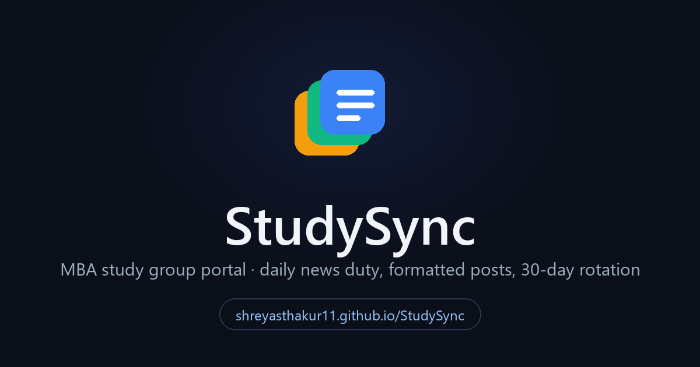
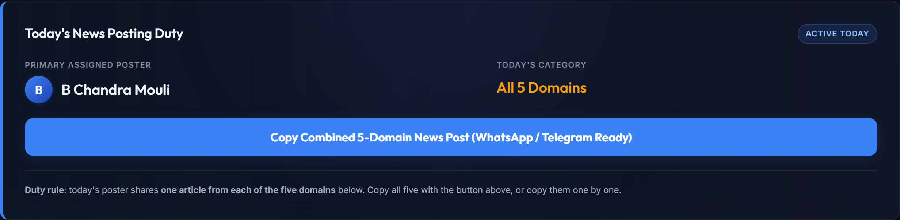
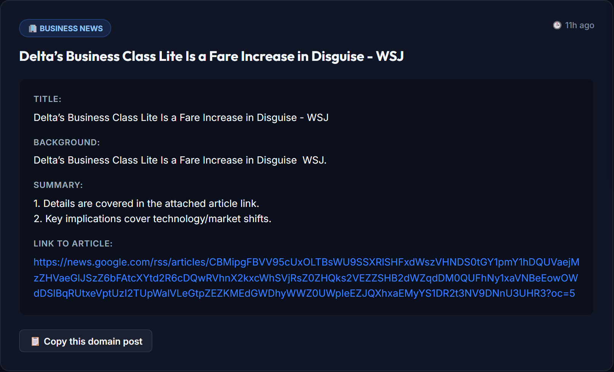
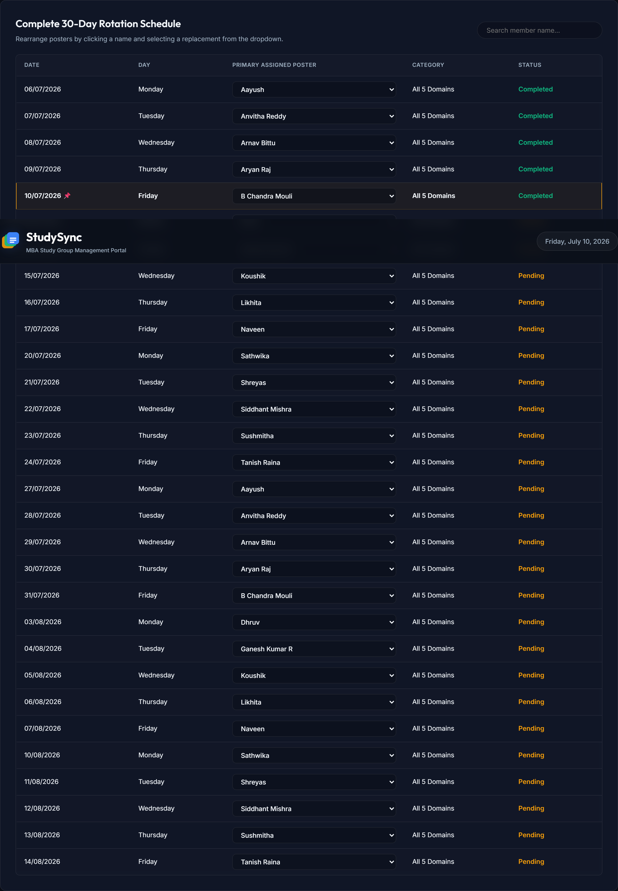
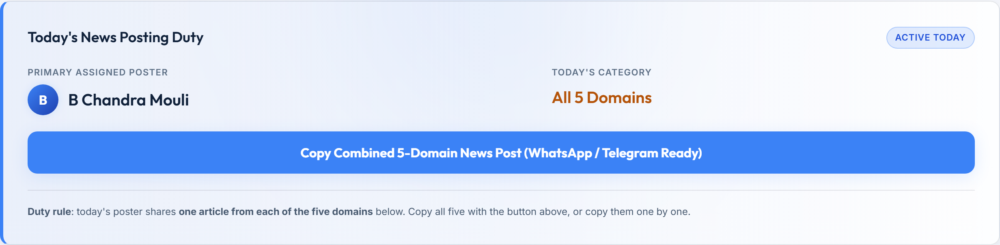

# StudySync

**Live portal: [shreyasthakur11.github.io/StudySync](https://shreyasthakur11.github.io/StudySync/)**

A study group management system for a 15-member MBA cohort. One member posts
business news to the group every weekday; StudySync decides who, gathers the
news, formats the post, and tracks the rotation.

It has two halves that share one schedule:

- **The web portal** (this repository, hosted on GitHub Pages): shows today's
  assigned poster, pulls live headlines for five business domains, formats a
  WhatsApp-ready post you can copy in one click, and lets you edit the 30-day
  rotation right in the browser.
- **The Google Workspace backend** (`apps-script/`): one script builds a full
  spreadsheet system (dashboard, member directory, schedule, news sources,
  settings) plus a registration form, and a second script sends automated
  daily reminders to whoever is on duty.



## The portal



The hero card answers the only question that matters each morning: whose turn
is it, and what do they post? The button copies a combined five-domain news
post, already formatted for WhatsApp or Telegram.



The compiler pulls current headlines from Google News RSS for five domains:
commerce, business, economics, industry, and technology. Every article is
pre-formatted (title, background, summary, link) and has its own copy button.
If a feed cannot be reached, curated fallback articles load instead, so the
poster is never stuck.



The full rotation is editable inline: swap any day's poster from a dropdown,
search by member name, export the schedule as CSV, or reset to the default
rotation. Edits persist in the browser's local storage.



The portal ships with dark and light themes. It follows the system preference
on first visit, and the sun/moon toggle in the header remembers your choice.

## The Google Workspace backend

One run of `apps-script/StudySync.gs` builds the entire system in about a
minute: a six-sheet spreadsheet (dashboard with live KPIs, member directory,
30-day schedule, 55+ curated news sources, settings, instructions) and a
member registration form whose responses sync automatically into the member
directory.

`apps-script/Reminders.gs` adds the automation: a daily trigger reads the
schedule, finds the member on duty, and sends the reminder through their
preferred channel. All configuration lives in named ranges, so the scripts
never hardcode a cell reference.

Setup takes five minutes and is fully scripted: see
[docs/setup-guide.md](docs/setup-guide.md).

## Running the portal locally

The portal is plain HTML, CSS and JavaScript. No build step, no dependencies.

```bash
git clone https://github.com/ShreyasThakur11/StudySync.git
cd StudySync
python -m http.server 8000
# open http://localhost:8000
```

## Repository layout

```
index.html            the portal (single page)
style.css             dark glassmorphism theme, accessibility styles
app.js                feeds, formatting, schedule logic (vanilla JS)
assets/               favicon and social preview image
apps-script/
  StudySync.gs        builds the spreadsheet system and form
  Reminders.gs        daily reminder automation and triggers
docs/
  setup-guide.md      step-by-step Google Workspace setup
  sheet-structure.md  every sheet, column and named range documented
  automation-integration-guide.md   how Phase 2 reads the named ranges
  images/             README screenshots
```

## Design notes

- **No servers, no keys.** The portal is static; feeds come from public RSS
  through CORS proxies with a three-proxy fallback chain and curated offline
  articles as the last resort.
- **Accessible by default.** Semantic landmarks, skip link, visible keyboard
  focus, labelled controls, live regions for async updates, and reduced-motion
  support.
- **Two themes, one set of tokens.** Dark and light share the same component
  styles; the theme is a variable flip that respects the system preference and
  persists per browser.
- **The schedule is deterministic.** Fifteen members, thirty weekdays, each
  member exactly twice, weekends excluded. The portal and the spreadsheet
  generate the same rotation from the same rules.

## About

Built and maintained by [Shreyas Thakur](https://github.com/ShreyasThakur11)
as the single point of contact for the study group. MIT licensed, see
[LICENSE](LICENSE).
